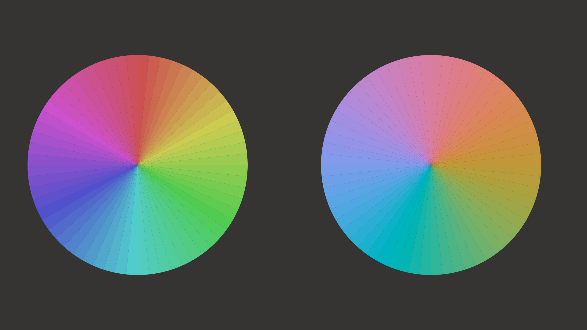

# //. GENERATIVE ART

Воркшоп для [shcrab.school](https://shcrab.school), березень 2026


---

## Професійний бекграунд:

розробник з 25+ роками досвіду, викладач. Працював у розробці ігор, зокрема у компанії Wargaming над проектом World of Tanks.
  
## Cфери мистецьких інтересів:

- фотографія
- музика, звук
- генеративне мистецтво


---
layout: two-cols-header
---

# Мета


::left::

## Теорія

- Визначення generative art
- Підходи, методи
- Інструменти

::right::

## Практика

- JavaScript та p5.js
- Базові графічні примітиви
- Випадковість і правила
- Робота з кольором


---
layout: image-right
image: ./anni-albers-untitled.jpg
---

## Anni Albers (1899–1994)

<br>

- [Роботи @ MOMA](https://www.moma.org/artists/96-anni-albers)
- Не generative artist, але приклад мислення через модуль, структуру, повтор і варіацію.


---
layout: image-right
image: ./lewitt-wall-drawing-instruction.jpg
---

## Sol LeWitt (1928—2007)

<br>
     
- [Серія "Wall Drawings"](https://massmoca.org/sol-lewitt/)  (з 1958)
- Радикально змістив увагу з об’єкта на систему й інструкцію.
- Його роботи добре показують, як правило, процедура і серія можуть бути повноцінною художньою формою.


---
layout: image-right
image: ./vera-molnar-1961-courtesy-of-galerie-oniris-rennes.jpg
---

## Vera Molnár (1924-2023)

<br>

- Одна з ключових фігур раннього алгоритмічного мистецтва.
- Працювала з варіацією, обмеженням, серійністю і мінімальним відхиленням як з повноцінним художнім матеріалом.
- Важлива як міст між модерністською абстракцією, системним мисленням і комп’ютерним мистецтвом.


---
layout: image-right
image: ./mohr-p62.jpg
---

## Manfred Mohr (b. 1938)

- [Роботи у музеї Вікторії й Альберта](https://collections.vam.ac.uk/search/?id_person=A21694&page=1&page_size=15)
- Один із найпослідовніших авторів у роботі з алгоритмом як автономною структурою.
- Його практика показує, як строгі формальні системи можуть давати дуже багатий візуальний і концептуальний результат.


---
layout: image-right
image: ./john-baldessari_throwing-three-balls-in-the-air-to-get-a-straight-line-best-of-thirty-six-attempts_AID1160750.jpg
backgrounSize: 10em 70%
---

## John Baldessari

<br>


- [Throwing Three Balls in the Air to Get a Straight Line (Best of Thirty-Six Attempts)](https://artmuseum.princeton.edu/art/collections/objects/135589) (1973)
- перетворення абсурдного завдання на чітку художню процедуру.

---

# Паралельна лінія в музиці

- У музиці споріднена лінія проходить через систему, повтор, тривалість, інструкцію і випадок.
- John Cage: chance operations та indeterminacy.
- Terry Riley, Steve Reich, Philip Glass: експериментальна та мінімалістична музики, заснована на системі та повторах.
- Brian Eno, generative music


---
layout: center
---

# Приклади систем

---
layout: image-right
image: ./wolfram-cellular-automata.svg
---
# Cellular automata

- [Elementary Cellular Automaton](https://mathworld.wolfram.com/ElementaryCellularAutomaton.html)
- Простий приклад, як складна поведінка може виникати з дуже локальних правил.
- Вперше описав Stephen Wolfram у книзі "A New Kind of Science" (2002).


---

# L-systems і рослини

- `L-systems` (`Lindenmayer systems`) це формальна система правил для моделювання росту й розгалуження рослин.
- Показують, як складна органічна форма може виростати з простого набору продукційних правил.
- Przemyslaw Prusinkiewicz та Aristid Lindenmayer, "The Algorithmic Beauty of Plants" (1990)

---

# Книжки

- `Stephen Wolfram` — `A New Kind of Science`
- `Przemyslaw Prusinkiewicz`, `Aristid Lindenmayer` — `The Algorithmic Beauty of Plants`
- `Douglas Hofstadter` — `Gödel, Escher, Bach`
- `Daniel Shiffman` — `The Nature of Code`

---

# Від системи до авторської мови

- Тут важлива лінія не “хто писав код”, а хто мислив через правило, серію, інструкцію, структуру і варіацію.
- У сучасному generative art це вже збирається в зрілу авторську практику: довгі серії, впізнавана мова, концептуальна послідовність.

---

# Jared Tarbell

- Один із ранніх авторів, які показали, що generative art може мати впізнавану авторську мову, а не бути просто технічною демонстрацією.
- Працює з роями, потоками, міськими структурами, щільністю, поведінкою великої кількості елементів.
- Важливий як приклад того, як системне мислення переходить у візуальну поетику.

---

# Tyler Hobbs

[https://www.tylerxhobbs.com](https://www.tylerxhobbs.com)

- Один із навідоміших сучасних генеративних митців із впізнаваним стилем
- Працює переважно у long-form форматі.
- Цікавий не тільки естетикою, а й дисципліною мислення: серія, параметричний простір, мова, що розвивається з проєкту в проєкт.
- [Роботи](https://www.tylerxhobbs.com/works)


---

# Manolo Gamboa Naon (manoloide)


- Поєднує щедру візуальність, живописність із системною логікою.

- [Велика колекція робіт на behance](https://www.behance.net/manoloide)

---

# Kazumasa Teshigawara (qubibi)

- Кінетична і алгоритмічна мова: прості елементи, з яких народжується складна, майже жива поведінка.
- Важливий як приклад автора, у якого форма, рух і система зібрані в одну дуже цілісну практику.

---

# Ryoji Ikeda

- Data-driven інсталяції та проєкції з дуже впізнаваною мовою.
- Міксує звук, дані, зображення і простор, але при цьому лишається дуже строгим формально.


---

# Dmitri Cherniak

- Один із найпереконливіших прикладів long-form generative practice, де серія працює як дослідження, а не як набір варіацій.
- Сильний баланс між формальною строгістю, алгоритмічною ясністю і людською інтуїцією.
- Добрий референс для розмови про те, як generative art може бути одночасно концептуальним, послідовним і дуже впізнаваним.

---

# Інструменти і середовища

- `Processing`: класичний sketchbook для visual coding; одна з головних точок входу в creative coding.
- `p5.js`: web-версія цієї логіки; проста точка входу, браузер, онлайн-редактор, швидкий feedback loop.
- `openFrameworks`: більш низькорівневий `C++` toolkit для інсталяцій, перформансу, камер, сенсорів, realtime систем.
- `TouchDesigner`: node-based середовище для інтерактивних візуалів, перформансу, інсталяцій і realtime pipelines.
- `three.js`: коли потрібен web-based `3D`, сцени, камери, матеріали, WebGL/WebGPU-логіка.
- `cables.gl`, `Hydra`, `Max/MSP/Jitter`, `Notch`, `Unity`: теж важлива частина екосистеми, але з іншими акцентами.


---

# p5.js

- `p5.js` це JavaScript-бібліотека для creative coding, натхненна `Processing`.
- Працює в браузері, тому старт дуже швидкий: відкрив, пишеш код, одразу бачиш результат.
- Reference: [p5js.org/reference](https://p5js.org/reference/)
- Online editor: [editor.p5js.org](https://editor.p5js.org/)

---

# JavaScript

- `JavaScript` це мова, якою ми тут пишемо скетчі.
- Нас цікавить не “вивчити всю мову”, а взяти мінімум, достатній для картинки, поведінки і правил.
- У фокусі: змінні, типи даних, функції, цикли, умови.

---

# Значення, або обє’кт


```js

42
"shcrab"
true

[135, 250, 135]
```

---

# Змінна

- Змінна це ім’я для значення або обє’кту
- `=` це операція присвоєння імені, не порівняння!

```js
let x = 42;
const name = "shcrab";
let visible = true;
let lightGreen = [135, 250, 135];
```

---

# Типи даних і типізація

- У `JavaScript` є числа, рядки, `boolean`, масиви, та інші типи.
- `JavaScript` має динамічну типізацію: тип значення не треба оголошувати наперед.
- Подивитись тип можна виразом `typeof`
- Результати операцій над значеннями різних типів можуть здивувати

```js
5 + "5"
5 * "5"
true + true
[] + []
```

---


# Функція

- Функція це шматок коду, який можна викликати багато разів.
- Вона може приймати аргументи
- ... і повертати результат (`return ...`).
- Окрім обчислень і результату, функція може мати т. зв. "побічні ефекти", наприклад щось малювати на екрані.

```js
function add(a, b) {
  return a + b
}
```

---

# Структура скетчу

- `setup()` виконується один раз на старті.
- `draw()` виконується знову і знову, кадр за кадром.
- якщо потрібна статична картинка - `noLoop()` зупиняє повторення
- `createCanvas(w, h)` задає розмір області для малювання

```js
function setup() {
  createCanvas(600, 600)
  noLoop()
}
```

---

# Canvas, піксель, координати

- `canvas` це площина, на якій ми малюємо.
- Позиція задається координатами `x` і `y`.
- Точка `(0, 0)` у `p5.js` знаходиться у верхньому лівому куті.
- Одиниця виміру тут зазвичай піксель.

---

# Базові примітиви

- Найпростіші елементи: `point()` і `line()`.
- Із них уже можна збирати ритм та структуру

```js
point(100, 100)
line(100, 100, 300, 300)
```

---

# Цикл

- Цикл потрібен, коли ми хочемо повторити дію багато разів.
- У generative art це один із головних інструментів.
- Є два види: з лічильником, і по існуючій колекції.

```js
for (let i = 0; i < 10; i++) {
  point(i * 20, 100)
}
```

```js
let points = [1, 2, 3];

for (let p of points) {
  print(p);
}
```


---

# Умова і branching

- `if / else if / else` дозволяє коду поводитися по-різному в різних ситуаціях.
- Це простий спосіб додати вибір, логіку і структуру.

```js
if (x < 200) {
  stroke(0)
} else {
  stroke(255, 0, 0)
}
```

---

# Випадковість

- `random()` повертає випадкове значення.
- `random([1, 2, 3])` повертає випадковий елемент послідовності.
- "природна" випадковість - `randomGaussian()`

```js
let x = random(width)
let y = random(height)
```

---


# Ентропія і випадковість


<div style="display: flex; gap: 20px; align-items: center; justify-content: center;">
  
  
  
</div>

---


# Live-coding: 10 PRINT

- Простий приклад, де з сітки, циклів і випадковості народжується патерн.
- На цій вправі добре видно, як правило + repetition + choice дають візуальну систему.


```vb
10 PRINT CHR$(205.5+RND(1)); : GOTO 10
```

---

# Поля

- Поле це спосіб описати поведінку простору: напрямок, силу, колір, щільність, деформацію.
- Воно корисне як композиційна основа, бо дозволяє не розкладати рішення вручну по кожній точці.
- Замість “малювати об’єкти” ми починаємо “конструювати середовище”.

---

# noise()

- `noise()` дає не білий шум, а плавно змінне значення, де сусідні точки схожі одна на одну.
- У `p5.js` це `Perlin noise`; поруч у generative practice часто згадують і `Simplex noise`.
- Це один із головних інструментів для органічного руху, текстур і полів.

```js
let n = noise(x * 0.01, y * 0.01)
```

---

# Flow field

- `flow field` це поле напрямків, яке задає, куди має рухатися точка або лінія в кожному місці простору.
- Часто його будують саме на `noise()`, перетворюючи значення шуму на кут або вектор.
- Це хороший приклад того, як просте правило породжує багату поведінку.

---

# Комбінування полів

- Найцікавіше часто починається, коли поле не одне.
- Можна змішувати напрямок, щільність, колір, маску, масштаб, турбулентність.
- Саме тут з’являється відчуття, що робота не “намальована”, а виросла з взаємодії кількох систем.

---

# Полярні координати. Фігури.

- Не весь простір зручно мислити через `x` і `y`.
- У полярних координатах точка задається через кут і радіус, що добре працює для кіл, спіралей, хвиль, розеток і радіальних структур.
- Це корисний перехід від сітки до більш “організованої” геометрії.

```js
let x = cx + cos(angle) * radius
let y = cy + sin(angle) * radius
```

---

# Колір: RGB

- `RGB` це модель кольору через `red`, `green`, `blue`.
- У `p5.js` це дефолтний режим.

```js
stroke(255, 0, 0)
fill(0, 120, 255)
```

---

# Колір: HSB

- `HSB` часто зручніший для generative art, бо відтінок, насиченість і яскравість розділені.
- Це дає більш інтуїтивний контроль над палітрою.

```js
colorMode(HSB)
stroke(200, 80, 90)
```

---

# Коли RGB недостатньо

- *RGB* погано відповідає тому, як ми сприймаємо різницю між кольорами.
- Градієнти, інтерполяція в *RGB* часто дають брудні або нерівномірні переходи.
- Для гармонійних палітр і контрольованих переходів краще підходять перцептивні моделі, такі як *OkLab/OkLCh*



---


# Кого ще дивитись

- Casey Reas: співзасновник `Processing`, ключова фігура у software-based art, системи й generative .
- Julien Gachadoat: плоттер-орієнтована практика, графічність.
- Sofia Crespo: дослідницька практика на перетині систем, природи, і спекулятивної біології.
- Iskra Velitchkova (`ognyveli`): сильна абстрактна мисткиня із впізнаваною мовою, серійністю і розвинутим відчуттям структури.
- Matt DesLauriers


---

# Де практикуватись

- [https://generativeartistry.com/tutorials/](https://generativeartistry.com/tutorials/)
- [The Nature of Code](https://natureofcode.com)
- [Generative Desing](http://www.generative-gestaltung.de/2/)


---
layout: center
class: text-center
---

# Дякую

[](https://www.instagram.com/otykhonruk/)

[@otykhonruk](https://www.instagram.com/otykhonruk/)
